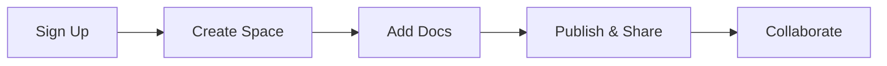

## Prerequisites

Before you begin, ensure you have:

<Callout kind="info">

- A modern web browser like Chrome, Firefox, or Safari
- An email address for account verification
- Optional: A team domain if using enterprise features

</Callout>

No software installation required—everything runs in your browser.

## Create Your Account

Sign up in under a minute. Follow these steps to get started.

<Steps>
  <Step title="Visit the Dashboard" icon="monitor">
    Navigate to `https://app.linksoftware.com` and click **Sign Up**.
  </Step>
  <Step title="Enter Your Details" icon="user">
    Provide your email, name, and a strong password. Accept the terms.
  </Step>
  <Step title="Verify Email" icon="mail">
    Check your inbox and click the verification link. This enables full access.
  </Step>
  <Step title="Complete Onboarding" icon="check-circle">
    Choose your workspace type (personal or team) and skip optional integrations for now.
  </Step>
</Steps>

## Set Up Your First Space

Spaces organize your documentation. Create one now.

<Steps>
  <Step title="Create New Space" icon="plus">
    From the dashboard, click **New Space** and name it `My Project Docs`.
  </Step>
  <Step title="Configure Settings" icon="settings">
    Set visibility to `Public` or `Private`, and add a description like `Documentation for Link Software project`.
  </Step>
  <Step title="Invite Collaborators" icon="users" default-open="false">
    Optionally, share the space invite link with your team via email.
  </Step>
</Steps>

<Callout kind="tip">

Pro tip: Use spaces to separate projects, like one for API docs and another for user guides.

</Callout>

## Add and Edit Your First Documents

Start building content with the intuitive editor.

<Tabs>
  <Tab title="Markdown Editor" icon="code">
    Create a new document and use Markdown syntax.

    <CodeGroup tabs="Default,With Components">
      ````markdown
      # Welcome

      This is your first doc.

      ## Features

      - Easy editing
      - Real-time collaboration
      ````

      ````mdx
      import { Callout } from 'components';

      <Callout kind="success">

      MDX supports components too!

      </Callout>
      ````
    </CodeGroup>
  </Tab>
  <Tab title="Visual Editor" icon="edit-3">
    Switch to WYSIWYG mode for non-technical users.

    Drag-and-drop images, tables, and embeds directly into your pages.
  </Tab>
</Tabs>

Save and publish to make it live.

## Basic Interface Tour

Familiarize yourself with key areas.

<Columns cols={3}>
  <Card title="Sidebar Navigation" icon="menu" href="#sidebar">
    Access spaces, docs, and settings here.
  </Card>
  <Card title="Editor Toolbar" icon="edit" href="#editor">
    Format text, add media, and preview changes.
  </Card>
  <Card title="Preview Pane" icon="eye" href="#preview">
    See real-time rendering before publishing.
  </Card>
</Columns>

## Next Steps

<Columns cols={2}>
  <Card title="Customize Your Space" icon="settings" href="/configuration">
    Explore themes, custom domains, and SEO settings.
  </Card>
  <Card title="Collaborate Securely" icon="shield" href="/authentication">
    Set up teams, roles, and authentication.
  </Card>
</Columns>

You're now ready to build comprehensive documentation. Check the [changelog](/changelog) for the latest features.

